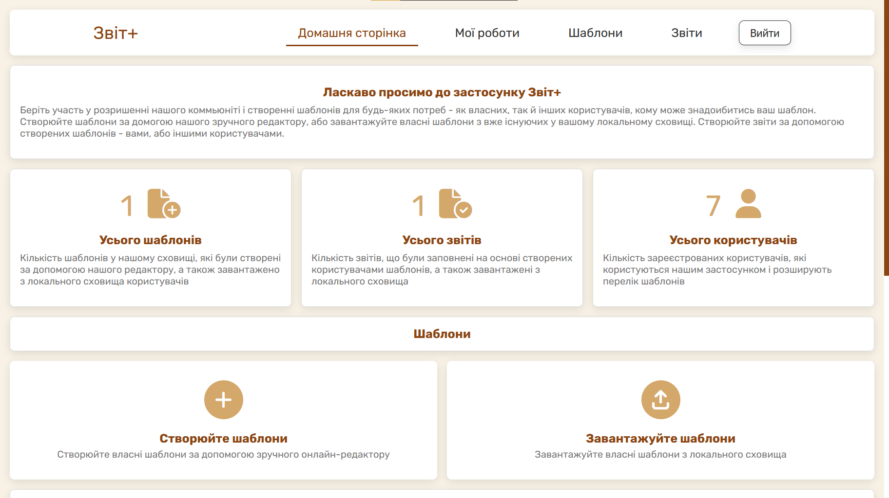
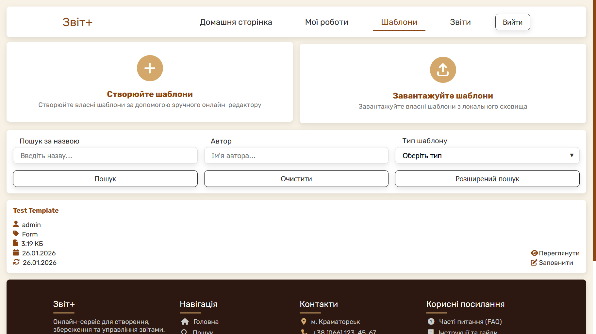
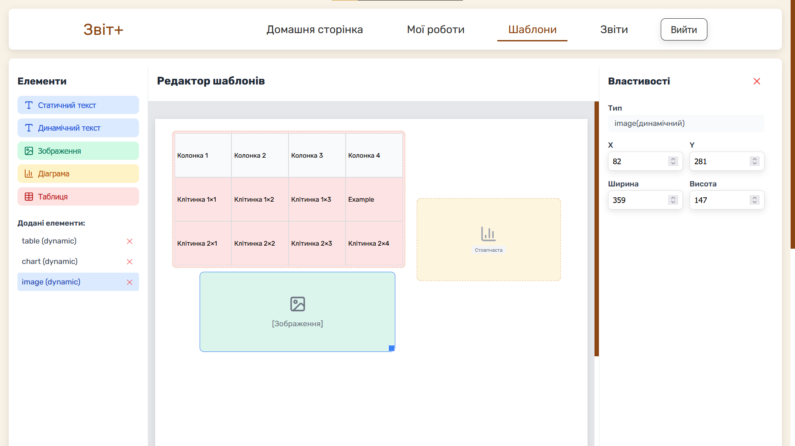

# Hi, I'm Roman

**Full-Stack Developer** crafting digital experiences from Ukraine

## Tech Stack & Tools

### Frontend

### Backend

### Tools

## GitHub Stats

    
    

## Featured Project

### ZvitPlus

**Project made for my third grade course work**

Designed to help users create reports for different goals.

Provides a user-friendly interface with a **template & report editor**, allowing:
- creation of template structures
- editing templates
- generating reports based on templates

**Tech**

**Screenshots**

    
    
<strong>Main page</strong> - Overview of statistics and main links

    
    

    <strong>Template page</strong> &bull; <strong>Editor page</strong> 
    <small>&nbsp;&nbsp;&nbsp;List of accessible templates</small> &bull; <small>Editor for template structure</small>

## Activity Graph

## Currently Learning

## Let's Connect

**From [xXx-GloriousPhoenix-xXx](https://github.com/xXx-GloriousPhoenix-xXx)**
